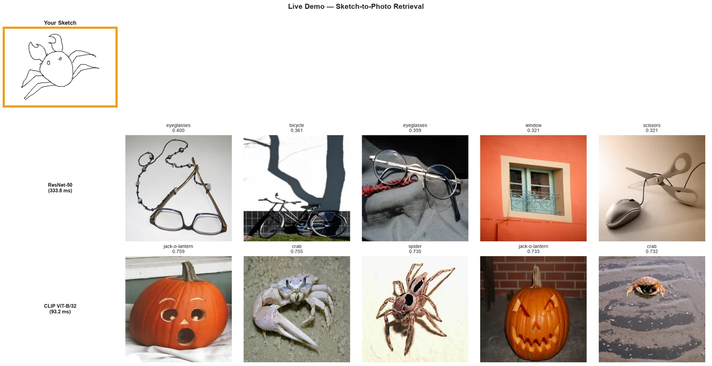
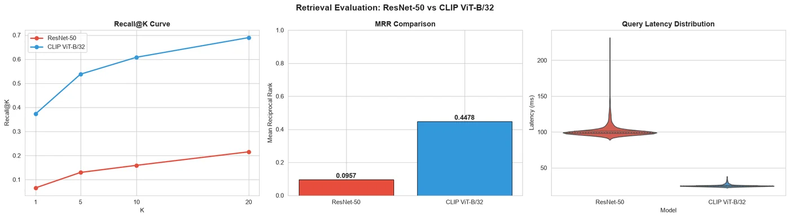
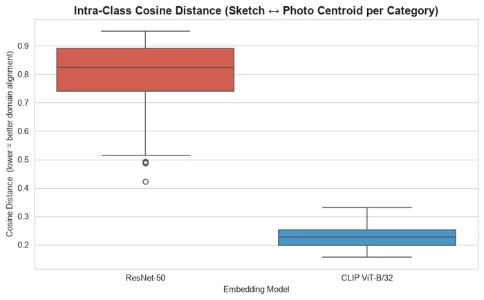
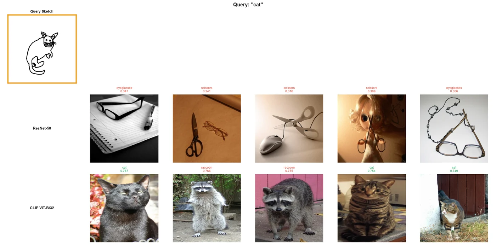
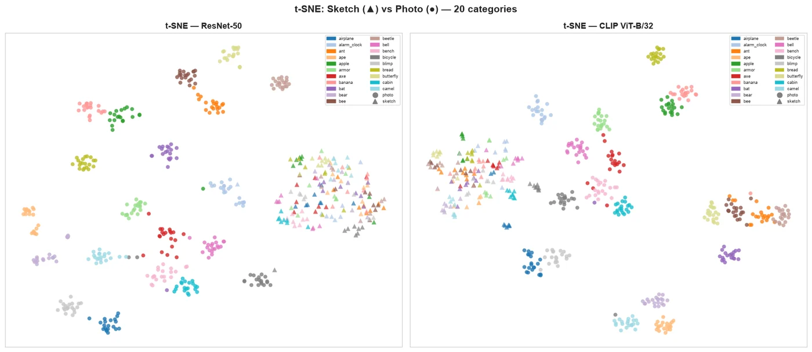
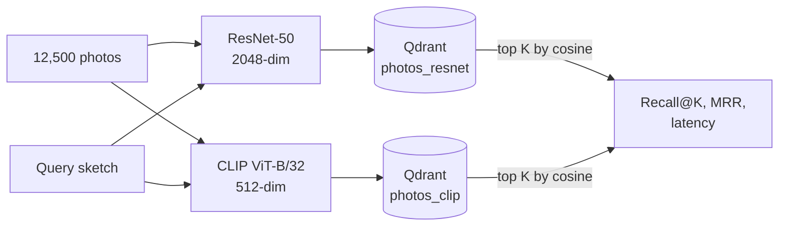

<div align="center">

# Sketch-to-Photo Retrieval

Draw something, get photographs of it back.<br>
A vector search benchmark that measures how well ResNet-50 and CLIP bridge the gap between hand-drawn sketches and photos.

[![Python][badge-python]][link-python]
[![PyTorch][badge-pytorch]][link-pytorch]
[![OpenCLIP][badge-openclip]][link-openclip]
[![Qdrant][badge-qdrant]][link-qdrant]
[![scikit-learn][badge-sklearn]][link-sklearn]
[![Jupyter][badge-jupyter]][link-jupyter]
[![License: MIT][badge-license]](LICENSE)



<sub>A crab I drew for the live demo. CLIP's top five include two crabs and a spider; ResNet-50 returns eyeglasses and a bicycle.</sub>

</div>

## About

Given a rough line drawing, the system searches 12,500 photographs and returns the closest matches. The search is purely vector-based: no text, labels or metadata take part in retrieval. Every photo and every query sketch is turned into an embedding, the photos are indexed in Qdrant, and a query is just a nearest-neighbour lookup by cosine similarity.

The hard part is the domain gap. Photos are full of colour, texture and shading; sketches are sparse black lines on white. I compared two off-the-shelf image encoders on how well they cross that gap without any fine-tuning: ResNet-50, trained to classify ImageNet photos, and CLIP ViT-B/32, trained to match images with their captions.

## Results

1,250 query sketches (10 from each of the 125 categories) against all 12,500 photos:

| Metric | ResNet-50 | CLIP ViT-B/32 |
|---|---|---|
| Recall@1 | 6.6% | 37.3% |
| Recall@5 | 13.0% | 53.8% |
| Recall@10 | 15.9% | 60.8% |
| Recall@20 | 21.5% | 69.0% |
| Mean reciprocal rank | 0.096 | 0.448 |
| Mean query latency | 102 ms | 25 ms |
| P95 query latency | 119 ms | 28 ms |
| Embedding size | 2,048 | 512 |

A query counts as a hit at K when at least one photo of the right category is in the top K results. CLIP finds one in the top ten for 61% of sketches, almost four times as often as ResNet-50, and it ranks correct photos much higher, with a mean reciprocal rank of 0.448 against 0.096.

<p align="center">
  
</p>

The domain gap shows up directly in the embeddings. For each category I averaged the sketch vectors and the photo vectors and measured the cosine distance between the two averages. With ResNet-50 that distance is 0.79 on average; with CLIP it drops to 0.23.

<p align="center">
  
</p>

## Why ResNet-50 struggles

ResNet-50 learned to recognise objects in photos, and a sketch has none of the texture, colour or shading that its features depend on. What a sketch does have is thin dark strokes on a plain background, and that is what ResNet-50 ends up matching: eyeglasses and scissors appear in its top five for the cat, the airplane and the crab alike.

<p align="center">
  
</p>

CLIP was trained to line images up with text descriptions, so its features describe what an object is more than how it was drawn or photographed. Its mistakes in these examples are near misses that share the drawing's shape or setting: raccoons for the cat, a seagull and blimps for the airplane, a spider and round jack-o'-lanterns for the crab.

The t-SNE projection of 20 categories shows that neither model fully merges the two domains: in both plots most sketches (triangles) still sit in their own region. With CLIP, more sketches land near their category's photos, and some categories, such as bicycle, overlap.

<p align="center">
  
</p>

## How it works



| Step | Details |
|---|---|
| Data | The [Sketchy Database](http://sketchy.eye.gatech.edu/) (Sangkloy et al., SIGGRAPH 2016): 125 categories, 12,500 photos and about 75,000 sketches, using the 256 x 256 renderings without augmentation |
| Queries | 10 sketches sampled at random from each category (seed 42), 1,250 in total |
| ResNet-50 | torchvision ImageNet weights (`IMAGENET1K_V2`) with the classification head removed, giving the 2,048-dimensional pooled features; resize to 256, centre-crop to 224, ImageNet normalisation |
| CLIP | OpenCLIP `ViT-B-32` with the OpenAI weights; only the image encoder is used, giving 512-dimensional features |
| Vectors | L2-normalised and cached as `.npy` files so later runs skip the encoding step |
| Index | One Qdrant collection per model with cosine distance and the photo's category and path stored as payload; HNSW configured with `m=16`, `ef_construct=100` |
| Metrics | Recall@1, 5, 10 and 20, mean reciprocal rank, and mean and 95th percentile query latency |

The notebook also projects both embedding spaces with PCA and t-SNE, draws a per-category Recall@10 heatmap, shows side-by-side retrieval grids for five categories, sweeps the HNSW search parameter `ef`, and ends with a live demo that embeds any image and shows the top five photos from each model.

### A note on the index

The notebook runs Qdrant through the Python client's in-memory local mode (`QdrantClient(":memory:")`). Local mode scores every stored vector with NumPy and ignores the HNSW settings, so every search here is exact. That has two consequences. The recall numbers measure the embeddings themselves, with no approximation error mixed in. And the `ef` sweep is flat (Recall@10 stays at 0.645 for every value from 10 to 200), because there is no graph to tune. The latency gap between the models comes from scanning 2,048-dimensional vectors instead of 512-dimensional ones. Pointing the same code at a Qdrant server would put the HNSW index to work.

## Running it

```bash
pip install -r requirements.txt
jupyter lab sketch_to_photo_retrieval.ipynb
```

A CUDA GPU makes the embedding step much faster (I used an RTX 3060 laptop GPU), but the notebook falls back to the CPU.

Download the rendered 256 x 256 version of the [Sketchy Database](http://sketchy.eye.gatech.edu/) and extract it next to the notebook so that these folders exist:

```
rendered_256x256/256x256/photo/tx_000000000000/<category>/
rendered_256x256/256x256/sketch/tx_000000000000/<category>/
```

The first run encodes everything and caches the vectors in `embeddings/`; after that the notebook loads them in seconds. Figures are written to `figs/`. To try your own drawing, save it as `my_sketch.png` (a cat in this repo) or point `DEMO_SKETCH_PATH` at another file; `crab_sketch.png` is the drawing from the figure at the top.

## Repository layout

```
.
├── sketch_to_photo_retrieval.ipynb   The full pipeline, evaluation and live demo
├── my_sketch.png                     Hand-drawn cat used by the live demo cell
├── crab_sketch.png                   Hand-drawn crab from the top figure
├── docs/images/                      Figures used in this README
└── requirements.txt
```

## Limitations and next steps

- A hit means any photo of the right category. Sketchy pairs every sketch with the specific photo it was drawn from, so instance-level retrieval (finding that exact photo) would be a much stricter test.
- Both encoders are used as they are. Fine-tuning on Sketchy's sketch and photo pairs, for example with a triplet loss, is the obvious way to close more of the gap.
- The evaluation uses 10 sketches per category. More queries would tighten the per-category numbers in the heatmap.
- The index runs in local mode, so the HNSW parameters were never actually exercised (see above).

## Credits and license

The Sketchy Database is by Patsorn Sangkloy, Nathan Burnell, Cusuh Ham and James Hays ("The Sketchy Database: Learning to Retrieve Badly Drawn Bunnies", ACM Transactions on Graphics, 2016). Its images are not included here. The code is released under the [MIT License](LICENSE).

## Author

Made by Rudra Somaiya.

[![GitHub][badge-github]][link-github]
[![LinkedIn][badge-linkedin]][link-linkedin]

[badge-python]: https://img.shields.io/badge/Python-3776AB?style=for-the-badge&logo=python&logoColor=white
[badge-pytorch]: https://img.shields.io/badge/PyTorch-2.5-EE4C2C?style=for-the-badge&logo=pytorch&logoColor=white
[badge-openclip]: https://img.shields.io/badge/OpenCLIP-ViT--B%2F32-412991?style=for-the-badge
[badge-qdrant]: https://img.shields.io/badge/Qdrant-DC244C?style=for-the-badge&logo=qdrant&logoColor=white
[badge-sklearn]: https://img.shields.io/badge/scikit--learn-F7931E?style=for-the-badge&logo=scikitlearn&logoColor=white
[badge-jupyter]: https://img.shields.io/badge/Jupyter-F37626?style=for-the-badge&logo=jupyter&logoColor=white
[badge-license]: https://img.shields.io/badge/License-MIT-F7DF1E?style=for-the-badge
[badge-github]: https://img.shields.io/badge/GitHub-RudraSomaiya-181717?style=for-the-badge&logo=github&logoColor=white
[badge-linkedin]: https://img.shields.io/badge/LinkedIn-Rudra_Somaiya-0A66C2?style=for-the-badge&logo=data:image/svg%2bxml;base64,PHN2ZyB4bWxucz0iaHR0cDovL3d3dy53My5vcmcvMjAwMC9zdmciIHZpZXdCb3g9IjAgMCAyNCAyNCI+PHBhdGggZmlsbD0iI2ZmZiIgZD0iTTIwLjQ1IDIwLjQ1aC0zLjU2di01LjU3YzAtMS4zMy0uMDItMy4wNC0xLjg1LTMuMDQtMS44NSAwLTIuMTQgMS40NS0yLjE0IDIuOTR2NS42N0g5LjM1VjloMy40MXYxLjU2aC4wNWMuNDgtLjkgMS42NC0xLjg1IDMuMzctMS44NSAzLjYgMCA0LjI3IDIuMzcgNC4yNyA1LjQ2djYuMjh6TTUuMzQgNy40M2EyLjA2IDIuMDYgMCAxIDEgMC00LjEyIDIuMDYgMi4wNiAwIDAgMSAwIDQuMTJ6TTcuMTIgMjAuNDVIMy41NlY5aDMuNTZ2MTEuNDV6TTIyLjIyIDBIMS43N0MuNzkgMCAwIC43NyAwIDEuNzN2MjAuNTRDMCAyMy4yMy43OSAyNCAxLjc3IDI0aDIwLjQ1Yy45OCAwIDEuNzgtLjc3IDEuNzgtMS43M1YxLjczQzI0IC43NyAyMy4yIDAgMjIuMjIgMHoiLz48L3N2Zz4=
[link-python]: https://www.python.org
[link-pytorch]: https://pytorch.org
[link-openclip]: https://github.com/mlfoundations/open_clip
[link-qdrant]: https://qdrant.tech
[link-sklearn]: https://scikit-learn.org
[link-jupyter]: https://jupyter.org
[link-github]: https://github.com/RudraSomaiya
[link-linkedin]: https://www.linkedin.com/in/rudra-somaiya/
